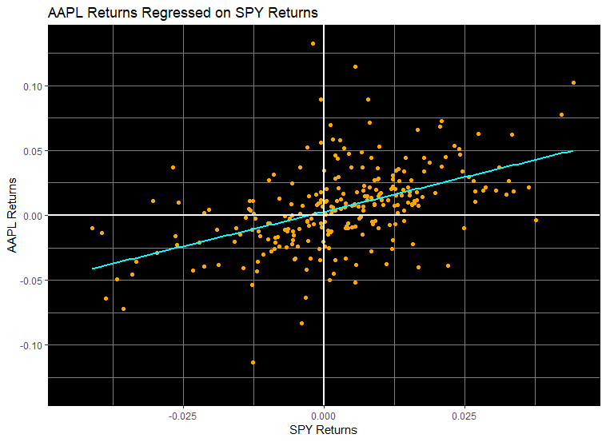

# Beta
Beta is the measure of an asset or portfolio's systematic risk in relation to the market. The most common formula to calculate beta is:

<a href="https://www.codecogs.com/eqnedit.php?latex=\dpi{120}&space;\beta_{a,b}=\frac{Cov(R_a,R_b)}{Var(R_b)}" target="_blank"></a>

where the numerator is the covariance of the asset and market; the denominator is the variance of the market. This `README.md` will briefly explain `beta.R` and how you can use it to obtain an asset's beta based on customizable parameters.

## R-Script
The code is simple: it requires the `tidyquant` package and consists entirely of one overarching function. To understand how it works, visualize the one function as a collection of smaller, nested functions that work as parts of a whole.

Firstly,
```r
tq_get(symbol,
      get  = "stock.prices",
      from = from,
      to   = to)
```
This grabs the stock's price data from Yahoo Finance. `symbol` represents a stock symbol, metal symbol, FRED code, etc. `get` represents the type of data to get for `symbol`. There are many data types, but we will use `"stock.prices"` to get the open, high, low, close, volume, and adjusted stock prices for `symbol`. `from` and `to` specifies the beginning and end dates of the data to collect, respectively. Note that `symbol`, `from`, and `to` are assigned variables which will later be defined in the overall function. It makes sense not to hard code these customizable parameters.

Next,
```r
tq_transmute(select    = adjusted, 
            mutate_fun = periodReturn, 
            period     = period, 
            type       = "log",
            col_rename = "Ra")
```
We will "feed" the data from `tq_get` to `tq_transmute` using a "pipe" or `%>%`. `tq_transmute` is a wrapper for the `tibble` data frame generated by `tq_get` and returns only newly created columns. `select` specifies the columns (from `tq_get`) that get passed to the mutation function. `mutate_fun` is the function that performs the work; in this case, it calculates period returns via `periodReturn`. `period` tells `periodReturn` to perform the calculation based on a specified frequency like daily, weekly, monthly, etc. `type = "log"` specifies log returns. Rename the column for simplicity later on.

Repeat the above to obtain market or index returns. The SPDR S&P 500 Trust ETF (NYSE Arca: SPY) is a common proxy for market returns, but one can use other indices if deemed appropriate. For example, the XLK index can be used for technology or telecom stocks.

Then, join the stock and market returns with `left_join` by date with `by = c("date" = "date")`. Use `tq_performance` to generate the stock beta with `performance_fun = CAPM.beta`. It is important to match `Ra` with stock returns and `Rb` with baseline (market) returns. `CAPM.beta` calculates beta using a linear intercept model:

<a href="https://www.codecogs.com/eqnedit.php?latex=\dpi{120}&space;\beta_{a,b}=\frac{Cov(R_a,R_b)}{Var(R_b)}=\frac{\sum((R_a-\bar{R_a})(R_b-\bar{R_b}))}{\sum(R_b-\bar{R_b})^2}" target="_blank"></a>

## Generating the Output
The beta function is given by:
```r
beta <- function(symbol,index,from,to,period)
```
Inputs:
* `symbol`: Stock symbol.
* `index`: Market symbol.
* `from`: Start date, in `yyyy-mm-dd` format.
* `to`: End date, in `yyyy-mm-dd` format.
* `period` : Frequency, such as `"daily"`, `"weekly"`, `"monthly"`.

The beta will be produced on the console. In addition, a scatterplot of stock returns regressed on index returns will be produced as well for visualization purposes. Below is a sample generated plot based on:
```r
beta(symbol = "AAPL", index = "SPY", from = "2013-10-30", to = "2018-10-30", period = "weekly")
```


## Built With
* [R](https://www.r-project.org/) - Software environment for statistical computing.
* [RStudio](https://www.rstudio.com/) - Free and open-source IDE for R.
* [CodeCogs](https://www.codecogs.com/latex/eqneditor.php) - Online equation editor.

## License
This project is licensed under the MIT License - see the `LICENSE.md` file for details.
